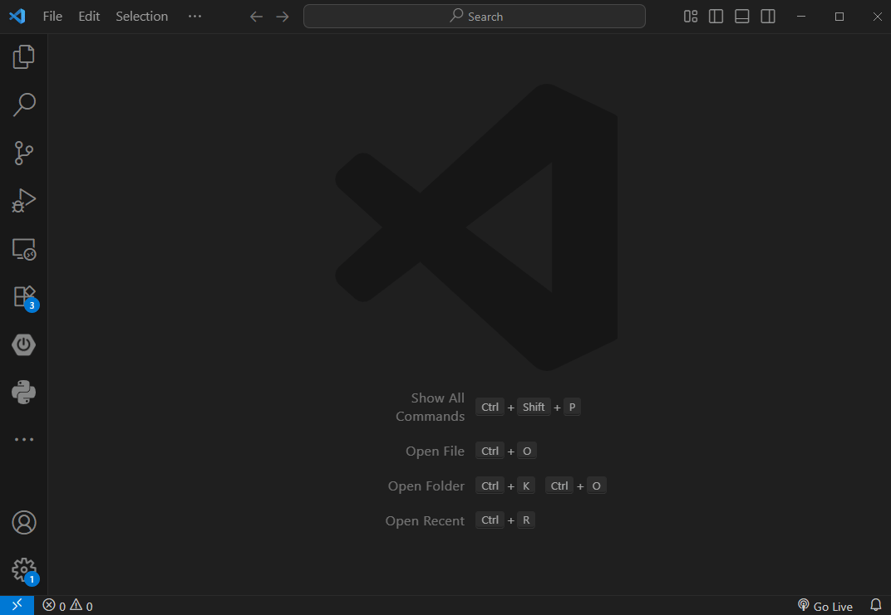
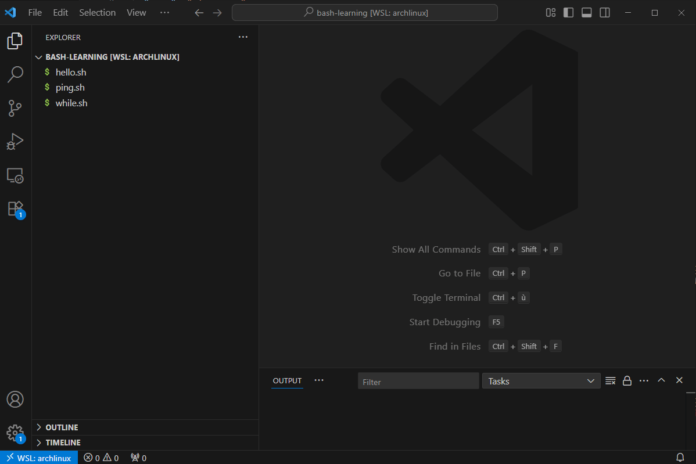

# Config VSCode + WSL2 + Bash Debug

## Installation d'une distribution Ubuntu WSL2

Sous l'OS Hôte Windows :
```ps1
wsl --install
```

## Procédure 

1. Lancer VSCode
2. se connecter au WSL en utilisant "Remote connexion"



3. Ouverture d'un dossier de travail

## Extension pour debug

[Lien vers l'extension](https://marketplace.visualstudio.com/items?itemName=rogalmic.bash-debug) permettant de bénéficier des fonctionnalités de debug :
- point d'arrêt;
- observation du contenu des variables.

Une fois l'extension installée il est possible de configurer le projet pour utiliser le débugger, comme présenté par le Gif suivant :

